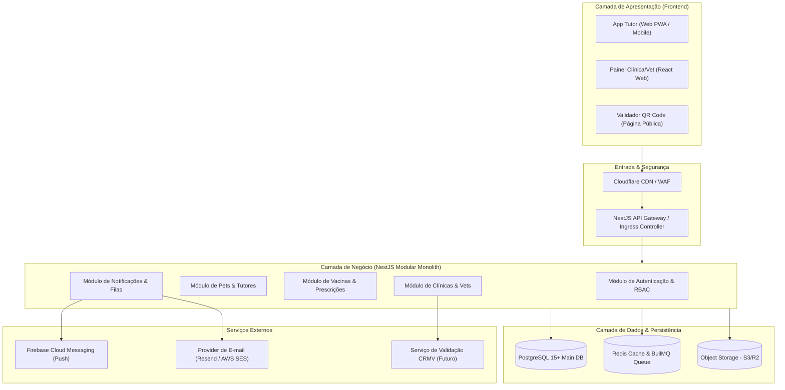
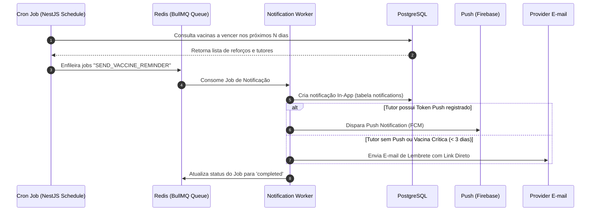
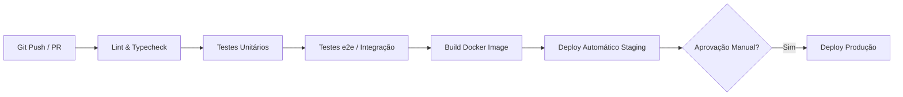

# Documento de Arquitetura de Software (DAS) — Pet em Dia

**Versão:** 1.0  
**Data:** 03/08/2026  
**Status:** Aprovado  
**Autor:** Engenharia de Software / Arquitetura de Sistemas  

---

## 1. Visão Geral e Metas de Arquitetura

O **Pet em Dia** é uma plataforma distribuída e multi-tenant para gestão de carteiras virtuais de vacinação pet, prescrições e alertas de saúde. O sistema conecta três públicos distintos:
1. **Tutores (B2C):** Acesso mobile-first para acompanhamento de históricos e alertas.
2. **Clínicas & Veterinários (B2B):** Acesso web/tablet otimizado para operações rápidas de prescrição e registro.
3. **Administradores da Plataforma:** Gestão global de governança e auditoria.

### 1.1 Atributos de Qualidade (NFRs Principais)
- **Disponibilidade (SLA):** Target de 99.9% para a API e módulo de consulta pública/carteira digital.
- **Desempenho:** Tempo de resposta da API P95 < 200ms para consultas de carteira; carregamento inicial do app < 2s.
- **Segurança & LGPD:** Criptografia em trânsito (TLS 1.3) e em repouso (AES-256); controle de acesso estrito via RBAC e isolamento multi-tenant.
- **Resiliência e Desconexão Parcial:** PWA com cache offline do histórico de vacinas para exibição sem internet no celular do tutor.

---

## 2. Visão Geral da Arquitetura de Sistemas

A arquitetura adota a estratégia de **Monolito Modular (Modular Monolith)** no backend utilizando **NestJS**, permitindo alta coesão e baixo acoplamento entre os domínios da aplicação, mantendo a simplicidade de deploy na fase de lançamento, com preparação nativa para evolução em microserviços caso haja necessidade de escala isolada.



---

## 3. Stack Tecnológica Detalhada

| Camada | Tecnologia Escolhida | Justificativa Técnica |
|---|---|---|
| **Language & Runtime** | TypeScript + Node.js 20 LTS | Tipagem estática fim-a-fim, alta performance I/O assíncrona, ecossistema maduro. |
| **Backend Framework** | **NestJS** | Arquitetura modular altamente estruturada (Injeção de Dependência, DTOs com `class-validator`, suporte nativo a Microservices e Filas). |
| **ORM / Data Mapper** | Prisma ORM ou TypeORM | Tipagem automática baseada no schema PostgreSQL, migrações declarativas seguras. |
| **Database** | PostgreSQL 15+ | SGBD relacional robusto com suporte a JSONB, UUIDs nativos, ACID e alta performance. |
| **Cache & Event Loop** | Redis 7+ | Cache de tokens/sessões, controle de rate-limiting e backend de filas para o BullMQ. |
| **Gerenciador de Filas** | BullMQ (Redis-based) | Processamento de tarefas em background com retentativas, delay de agendamento e concorrência controlada. |
| **Frontend Web/PWA** | React 18+ / Next.js (App Router) | SSR/SSG para páginas de validação pública + PWA responsivo com Service Workers. |
| **Push Notifications** | Firebase Cloud Messaging (FCM) | Padrão da indústria para envio de Web Push e Native Push gratuito e escalável. |
| **E-mail Transacional** | Resend / AWS SES | Envio confiável de e-mails transacionais e de fallback com alta entregabilidade. |

---

## 4. Arquitetura de Notificações e Agendamento de Lembretes

Conforme definido nas diretrizes do projeto, o sistema adota uma **estratégia híbrida de canais de notificação**:

### 4.1 Fluxo de Notificação
1. **Central In-App (Canal Principal):** Qualquer lembrete de vacina pendente/próxima gera um registro no banco de dados na tabela `notifications` com status `unread`. O app exibe o badge/sininho imediatamente.
2. **Push Notification (Canal Prioritário Móvel):** Se o tutor possui o Web Push/App ativo, o serviço dispara um evento Push via FCM.
3. **E-mail (Canal Fallback / Tutores sem App):** Se a vacina estiver a $N$ dias do vencimento (ex: 7 dias e 1 dia antes) e o tutor não tiver marcado visualização In-App ou se for preferência do usuário, um e-mail com Deep Link é enfileirado no BullMQ.



---

## 5. Segurança, Autenticação e RBAC

### 5.1 Estratégia de Autenticação
- **Autenticação Baseada em Tokens JWT (JSON Web Tokens):**
  - **Access Token:** Expiração curta (15 a 30 minutos). Armazenado em memória/state no frontend.
  - **Refresh Token:** Expiração longa (7 a 30 dias). Armazenado em HTTP-Only, Secure, SameSite Cookie para mitigação de ataques XSS.
- **Controle de Sessão via Redis:** Possibilidade de revogação instantânea de sessões por usuário ou por clínica.

### 5.2 Controle de Acesso Baseado em Funções (RBAC)
O NestJS utilizará `@Guards` e `@Roles` customizados para validar o perfil antes de executar os handlers de controlador:

```typescript
// Exemplo de aplicação das Roles nos Controllers
@UseGuards(JwtAuthGuard, RolesGuard)
@Roles(UserRole.VETERINARIAN, UserRole.CLINIC_ADMIN)
@Post('vaccinations')
async registerVaccination(@Body() dto: CreateVaccinationDto) { ... }
```

### 5.3 Validação e Integridade de Dados de Vacinação
- **Imutabilidade de Aplicações:** Registros de vacina confirmados por veterinários **não podem ser deletados**. Alterações exigem criação de um registro de *retificação* com justificativa auditada (tabela `vaccinations` com `status = rectified`).
- **Assinatura / QR Code:** Cada carteira/comprovante emitido gera um token hash SHA-256 único assinado com chave privada do sistema para validação pública no endpoint `/v1/public/validate-vaccine/:hash`.

---

### 6.1 Estrutura Raiz do Repositório (Monorepo)

O projeto adota uma organização em **Monorepo limpo**, mantendo os artefatos de documentação, identidade visual, backend e frontend organizados na raiz do projeto:

```text
PetEmDia/
├── Api/                    # Aplicação Backend (Node.js + NestJS)
├── Web/                    # Aplicação Frontend (React / Next.js)
├── Docs/                   # Documentação do projeto (Requisitos, DAS, Modelos)
└── Logo/                   # Assets da marca e Identidade Visual
```

### 6.2 Estrutura Interna da API (`Api/src/`)

Dentro do diretório `Api/`, o projeto backend seguirá os princípios de **Clean Architecture** e **Monolito Modular**:

```text
Api/src/
├── core/                   # Utilitários compartilhados, Guards, Interceptors, Filters
│   ├── decorators/
│   ├── guards/
│   ├── interceptors/
│   └── pipes/
├── config/                 # Configurações de ambiente (env validation com Zod/Joi)
├── modules/
│   ├── auth/               # Autenticação, Tokens, Passwords
│   ├── users/              # Gestão de usuários (Tutores, Vets, Admins)
│   ├── pets/               # Cadastro e gestão de Pets
│   ├── clinics/            # Gestão de Clínicas e Vínculos de Vets
│   ├── vaccinations/       # Prescrições, Aplicações e Carteira
│   └── notifications/      # Workers BullMQ, E-mail e Push
└── database/               # Migrations, Seeds e Schemas do ORM
```

### 6.3 Estrutura Interna da Aplicação Frontend (`Web/src/`)

Dentro do diretório `Web/`, a aplicação frontend seguirá a organização moderna por recursos (*Feature-based*) e componentes do Next.js (App Router) / React:

```text
Web/src/
├── app/                    # Rotas e páginas (Next.js App Router)
│   ├── (auth)/             # Rotas de Login, Registro, Recuperação de Senha
│   ├── (tutor)/            # Módulo Tutor (Dashboard, Pets, Carteira Digital, Notificações)
│   ├── (clinic)/           # Módulo Clínica/Vet (Prescrições, Atendimento, Cadastro de Vets)
│   ├── public/             # Páginas Públicas (Validação de QR Code de Vacina)
│   ├── layout.tsx          # Layout Raiz e Providers (Auth, Query, Theme)
│   └── page.tsx            # Landing Page / Home
├── components/             # Design System & Componentes Reutilizáveis
│   ├── ui/                 # Componentes base (Botões, Cards, Modais, Inputs - Tailwind/CSS)
│   ├── pet/                # Componentes específicos de Pet (Avatar, Card de Vacina)
│   ├── vaccination/        # Componentes de Vacina (Timeline, Badge de Status)
│   └── shared/             # Header, Navbar, Sidebar, Central de Notificações
├── hooks/                  # Custom Hooks (useAuth, useNotifications, useOfflineCache)
├── services/               # Clientes de API (Axios/Fetch), React Query / SWR
├── store/                  # Gerenciamento de Estado Global (Zustand / React Context)
├── styles/                 # Estilos globais, tokens de cor da Identidade Visual e CSS Modules
├── types/                  # Definições de Tipos TypeScript (DTOs espelhados da API)
└── utils/                  # Utilitários, formatadores (datas, CPF/CNPJ, CRMV) e validações
```

---


## 7. Estratégia de Infraestrutura e CI/CD

### 7.1 Ambientes
1. **Development (Local):** Docker Compose executando NestJS (Watch Mode), PostgreSQL e Redis.
2. **Staging (Preview/HMG):** Ambiente espelho de produção para validações de homologação com stakeholders.
3. **Production (PROD):** Infraestrutura escalável em nuvem com réplicas de leitura para o banco PostgreSQL.

### 7.2 Pipeline CI/CD (GitHub Actions)


---

## 8. Próximos Passos de Engenharia

1. Configuração do repositório monorepo ou multirepo (NestJS API + Next.js App).
2. Setup do `docker-compose.yml` para ambiente de desenvolvimento local.
3. Implementação da estrutura base do NestJS com autenticação JWT e Guards RBAC.
