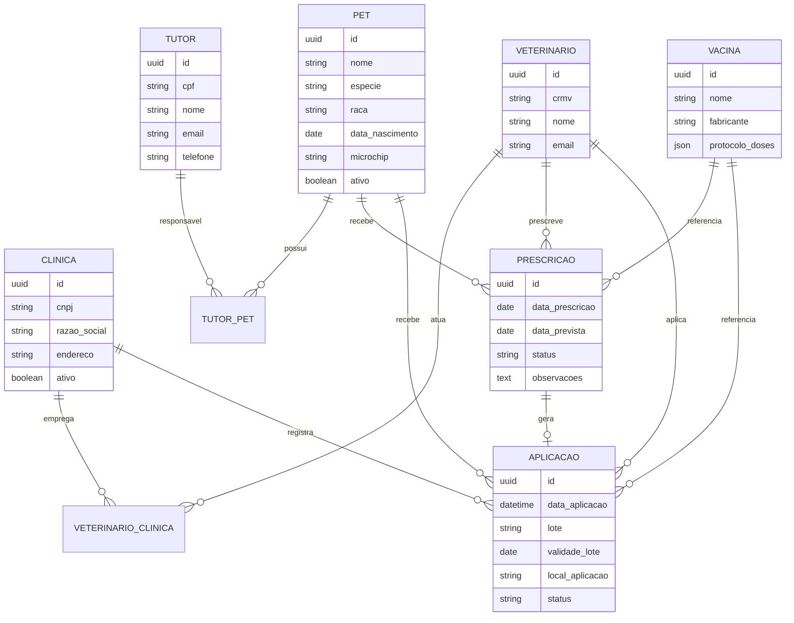

# Documento de Requisitos — Carteira Digital de Vacinação de Pets

**Versão:** 1.0  

**Data:** 27/07/2026  

**Autor:** Levantamento de Requisitos — Análise de Sistemas  

**Status:** Rascunho para validação com stakeholders  

---

## 1. Visão geral

### 1.1 Objetivo do sistema

Desenvolver uma aplicação multiplataforma (celular, tablet e notebook) para registro, prescrição, aplicação e consulta da carteira de vacinação de animais de estimação, conectando **clínicas veterinárias**, **médicos veterinários** e **tutores** em um único ecossistema digital confiável.

### 1.2 Problema a resolver

- Carteiras físicas se perdem, danificam ou ficam desatualizadas.

- Tutores com múltiplos pets têm dificuldade de centralizar históricos.

- Clínicas registram vacinas de formas inconsistentes (papel, planilha, sistemas isolados).

- Falta rastreabilidade entre prescrição, aplicação e comprovante para o tutor.

- Dificuldade de lembrar reforços e campanhas de vacinação.

### 1.3 Escopo

| Dentro do escopo | Fora do escope (fase inicial) |
|------------------|-------------------------------|
| Cadastro de clínicas, veterinários, tutores e pets | Telemedicina veterinária |
| Prescrição e registro de vacinação | Prontuário eletrônico completo |
| Carteira digital por pet | Integração com farmácias |
| Notificações de reforço | Pagamentos e faturamento |
| Compartilhamento controlado da carteira | IA para diagnóstico |
| Acesso responsivo (PWA ou app nativo + web) | Registro de microchip/nacional |
### 1.4 Definições

| Termo | Definição |
|-------|-----------|
| **Pet** | Animal de estimação vinculado a um ou mais tutores |
| **Tutor** | Responsável legal/cuidador do pet |
| **Carteira** | Histórico digital de vacinas aplicadas e pendentes |
| **Prescrição** | Indicação veterinária de vacina(s) a aplicar |
| **Aplicação** | Registro da vacina efetivamente administrada |
| **Reforço** | Dose subsequente conforme protocolo ou fabricante |
---

## 2. Stakeholders e personas

### 2.1 Stakeholders

| Stakeholder | Interesse |
|-------------|-----------|
| Tutores | Acesso fácil, confiável e portátil à carteira |
| Médicos veterinários | Registrar prescrições e aplicações com agilidade |
| Clínicas veterinárias | Padronizar registros, fidelizar clientes, auditoria |
| Administrador da plataforma | Governança, suporte, conformidade (LGPD) |
| Reguladores / associações veterinárias | Validade e rastreabilidade dos registros (futuro) |
### 2.2 Personas

**Persona 1 — Tutor (Maria, 34 anos)**  

Possui 2 cães e 1 gato. Quer receber lembretes de reforço e apresentar a carteira em qualquer clínica.

**Persona 2 — Veterinário (Dr. Ricardo, 42 anos)**  

Atende em clínica e domicílio. Precisa registrar aplicações rapidamente no celular/tablet.

**Persona 3 — Recepcionista/Admin da clínica (Ana, 28 anos)**  

Gerencia cadastro de tutores, agenda e validação de registros da equipe.

**Persona 4 — Tutor co-responsável (João, 29 anos)**  

Compartilha a guarda do pet; precisa de acesso somente leitura ou limitado.

---

## 3. Perfis de usuário e permissões (RBAC)

### 3.1 Perfis

| Perfil | Descrição |
|--------|-----------|
| **Super Admin (Plataforma)** | Gestão global da aplicação |
| **Admin da Clínica** | Gestão da clínica, equipe e configurações |
| **Médico Veterinário** | Prescreve e registra aplicações |
| **Auxiliar/Recepção** | Cadastros, agendamentos, apoio operacional |
| **Tutor** | Visualiza e gerencia pets vinculados |
| **Tutor Convidado** | Acesso delegado (leitura ou parcial) |
### 3.2 Matriz de permissões (resumo)

| Funcionalidade | Super Admin | Admin Clínica | Veterinário | Recepção | Tutor | Tutor Convidado |
|----------------|:-----------:|:-------------:|:-----------:|:--------:|:-----:|:---------------:|
| Cadastrar clínica | ✅ | ❌ | ❌ | ❌ | ❌ | ❌ |
| Convidar veterinários | ✅ | ✅ | ❌ | ❌ | ❌ | ❌ |
| Prescrever vacina | ❌ | ❌ | ✅ | ❌ | ❌ | ❌ |
| Registrar aplicação | ❌ | ❌ | ✅ | ⚠️* | ❌ | ❌ |
| Ver carteira do pet | ❌ | ⚠️** | ✅ | ⚠️** | ✅ | ⚠️*** |
| Cadastrar pet | ❌ | ❌ | ✅ | ✅ | ✅ | ❌ |
| Exportar carteira (PDF) | ❌ | ✅ | ✅ | ✅ | ✅ | ⚠️*** |
| Configurar lembretes | ❌ | ✅ | ❌ | ❌ | ✅ | ❌ |
\* Conforme política da clínica  

\*\* Apenas pets atendidos/vinculados à clínica  

\*\*\* Conforme permissão delegada pelo tutor  

---

## 4. Requisitos funcionais (RF)

### 4.1 Autenticação e acesso (RF-AUT)

| ID | Requisito | Prioridade |
|----|-----------|------------|
| RF-AUT-001 | O sistema deve permitir cadastro e login com e-mail e senha | Alta |
| RF-AUT-002 | O sistema deve suportar autenticação social (Google/Apple) | Média |
| RF-AUT-003 | O sistema deve implementar recuperação de senha | Alta |
| RF-AUT-004 | O sistema deve suportar MFA (2FA) para perfis clínica e veterinário | Alta |
| RF-AUT-005 | O sistema deve manter sessão segura em múltiplos dispositivos | Alta |
| RF-AUT-006 | O sistema deve permitir logout remoto de dispositivos | Média |
### 4.2 Gestão de clínicas (RF-CLI)

| ID | Requisito | Prioridade |
|----|-----------|------------|
| RF-CLI-001 | Cadastrar clínica com CNPJ, razão social, endereço, contatos e logo | Alta |
| RF-CLI-002 | Validar unicidade de CNPJ | Alta |
| RF-CLI-003 | Admin da clínica deve convidar veterinários por e-mail | Alta |
| RF-CLI-004 | Veterinário deve aceitar vínculo com clínica antes de atuar | Alta |
| RF-CLI-005 | Clínica deve configurar horário, serviços e vacinas ofertadas | Média |
| RF-CLI-006 | Clínica deve visualizar histórico de atendimentos/vacinações | Alta |
| RF-CLI-007 | Clínica deve poder inativar veterinário sem apagar histórico | Alta |
### 4.3 Gestão de veterinários (RF-VET)

| ID | Requisito | Prioridade |
|----|-----------|------------|
| RF-VET-001 | Cadastrar veterinário com CRMV, nome, especialidade e contato | Alta |
| RF-VET-002 | Validar formato e unicidade do CRMV | Alta |
| RF-VET-003 | Veterinário deve poder atuar em uma ou mais clínicas | Média |
| RF-VET-004 | Veterinário deve visualizar pets atendidos e prescrições pendentes | Alta |
| RF-VET-005 | Veterinário deve registrar assinatura digital ou carimbo eletrônico | Média |
### 4.4 Gestão de tutores (RF-TUT)

| ID | Requisito | Prioridade |
|----|-----------|------------|
| RF-TUT-001 | Tutor deve se cadastrar com dados pessoais e contato | Alta |
| RF-TUT-002 | Tutor deve poder vincular um ou mais pets | Alta |
| RF-TUT-003 | Tutor deve convidar co-tutor com permissões configuráveis | Média |
| RF-TUT-004 | Tutor deve revogar acesso de co-tutor a qualquer momento | Alta |
| RF-TUT-005 | Tutor deve receber notificações de vacinas e reforços | Alta |
### 4.5 Gestão de pets (RF-PET)

| ID | Requisito | Prioridade |
|----|-----------|------------|
| RF-PET-001 | Cadastrar pet com nome, espécie, raça, sexo, data nascimento, peso, foto | Alta |
| RF-PET-002 | Pet deve ter identificador único na plataforma | Alta |
| RF-PET-003 | Pet pode ter microchip (opcional) | Média |
| RF-PET-004 | Pet pode ter múltiplos tutores (co-responsáveis) | Alta |
| RF-PET-005 | Pet pode ser transferido para novo tutor (com auditoria) | Média |
| RF-PET-006 | Pet inativo/falecido deve ser arquivado sem exclusão de histórico | Alta |
| RF-PET-007 | Suportar espécies: cão, gato e expandível (ave, réptil etc.) | Alta |
### 4.6 Catálogo de vacinas (RF-VAC)

| ID | Requisito | Prioridade |
|----|-----------|------------|
| RF-VAC-001 | Manter catálogo de vacinas (nome, fabricante, espécie, protocolo) | Alta |
| RF-VAC-002 | Cada vacina deve ter esquema de doses e intervalos de reforço | Alta |
| RF-VAC-003 | Admin plataforma deve atualizar catálogo central | Alta |
| RF-VAC-004 | Clínica pode restringir vacinas disponíveis no seu contexto | Média |
| RF-VAC-005 | Registrar lote, validade e fabricante na aplicação | Alta |
### 4.7 Prescrição e aplicação (RF-REG)

| ID | Requisito | Prioridade |
|----|-----------|------------|
| RF-REG-001 | Veterinário deve prescrever vacina(s) para pet | Alta |
| RF-REG-002 | Prescrição deve conter: vacina, dose, observações, data prevista | Alta |
| RF-REG-003 | Veterinário deve registrar aplicação vinculada à prescrição | Alta |
| RF-REG-004 | Aplicação deve conter: data/hora, local anatomico, lote, validade, profissional, clínica | Alta |
| RF-REG-005 | Sistema deve calcular automaticamente próxima dose/reforço | Alta |
| RF-REG-006 | Permitir registro retroativo com justificativa e trilha de auditoria | Média |
| RF-REG-007 | Impedir edição de registro após confirmação (somente retificação auditada) | Alta |
| RF-REG-008 | Gerar comprovante digital da aplicação | Alta |
### 4.8 Carteira digital (RF-CAR)

| ID | Requisito | Prioridade |
|----|-----------|------------|
| RF-CAR-001 | Exibir carteira por pet com timeline de vacinas | Alta |
| RF-CAR-002 | Diferenciar vacinas aplicadas, pendentes e atrasadas | Alta |
| RF-CAR-003 | Exibir status visual (em dia / pendente / atrasada) | Alta |
| RF-CAR-004 | Exportar carteira em PDF com QR Code verificável | Alta |
| RF-CAR-005 | Compartilhar carteira via link temporário com expiração | Média |
| RF-CAR-006 | Modo offline: visualização da última carteira sincronizada | Média |
| RF-CAR-007 | QR Code deve permitir verificação pública limitada (sem dados sensíveis) | Média |
### 4.9 Notificações e lembretes (RF-NOT)

| ID | Requisito | Prioridade |
|----|-----------|------------|
| RF-NOT-001 | Notificar tutor sobre reforços próximos (configurável: 7, 3, 1 dia) | Alta |
| RF-NOT-002 | Notificar clínica sobre prescrições pendentes | Média |
| RF-NOT-003 | Canais: push, e-mail e SMS (SMS fase 2) | Alta |
| RF-NOT-004 | Tutor deve poder silenciar notificações por pet | Média |
### 4.10 Busca e vinculação tutor ↔ clínica (RF-VIN)

| ID | Requisito | Prioridade |
|----|-----------|------------|
| RF-VIN-001 | Tutor deve encontrar clínica por nome, CNPJ ou geolocalização | Média |
| RF-VIN-002 | Clínica deve localizar tutor/pet por CPF, e-mail ou código do pet | Alta |
| RF-VIN-003 | Vincular atendimento gera registro na carteira automaticamente | Alta |
| RF-VIN-004 | Tutor deve autorizar compartilhamento de dados do pet com clínica | Alta |
### 4.11 Auditoria e conformidade (RF-AUD)

| ID | Requisito | Prioridade |
|----|-----------|------------|
| RF-AUD-001 | Registrar log de todas alterações em prescrições e aplicações | Alta |
| RF-AUD-002 | Registrar IP, usuário, data/hora e ação | Alta |
| RF-AUD-003 | Exportar logs para auditoria da clínica | Média |
| RF-AUD-004 | Atender LGPD: consentimento, acesso, retificação e exclusão | Alta |
### 4.12 Administração da plataforma (RF-ADM)

| ID | Requisito | Prioridade |
|----|-----------|------------|
| RF-ADM-001 | Super admin gerencia clínicas, planos e catálogo global | Alta |
| RF-ADM-002 | Dashboard com métricas: usuários, vacinas, clínicas ativas | Média |
| RF-ADM-003 | Gestão de tickets de suporte | Baixa |
| RF-ADM-004 | Bloquear clínica/usuário por violação de termos | Alta |
---

## 5. Requisitos não funcionais (RNF)

### 5.1 Plataforma e UX

| ID | Requisito | Métrica |
|----|-----------|---------|
| RNF-001 | Responsivo para celular, tablet e notebook | Breakpoints mobile-first |
| RNF-002 | PWA instalável ou app nativo iOS/Android + web | Decisão arquitetural |
| RNF-003 | Tempo de carregamento inicial | < 3s em 4G |
| RNF-004 | Acessibilidade WCAG 2.1 AA | Auditoria |
| RNF-005 | Suporte offline parcial (visualização) | MVP+ |
### 5.2 Performance e disponibilidade

| ID | Requisito | Métrica |
|----|-----------|---------|
| RNF-006 | Disponibilidade | 99,5% mensal |
| RNF-007 | API response time (p95) | < 500ms |
| RNF-008 | Suportar 10.000 usuários concorrentes (fase 2) | Load test |
### 5.3 Segurança

| ID | Requisito |
|----|-----------|
| RNF-009 | HTTPS/TLS 1.2+ em todas comunicações |
| RNF-010 | Senhas com hash bcrypt/argon2 |
| RNF-011 | Tokens JWT com refresh e expiração |
| RNF-012 | RBAC em backend (não só frontend) |
| RNF-013 | Criptografia de dados sensíveis em repouso |
| RNF-014 | Rate limiting e proteção contra OWASP Top 10 |
| RNF-015 | Backup diário com retenção de 30 dias |
### 5.4 LGPD e privacidade

| ID | Requisito |
|----|-----------|
| RNF-016 | Termo de consentimento no cadastro |
| RNF-017 | Política de privacidade e base legal documentada |
| RNF-018 | Anonimização/exclusão sob solicitação do titular |
| RNF-019 | DPO/contato de privacidade definido |
| RNF-020 | Registro de operações de tratamento de dados |
### 5.5 Manutenibilidade

| ID | Requisito |
|----|-----------|
| RNF-021 | API REST ou GraphQL documentada (OpenAPI) |
| RNF-022 | Logs estruturados e monitoramento (APM) |
| RNF-023 | CI/CD com ambientes dev/staging/prod |
| RNF-024 | Cobertura mínima de testes automatizados: 70% core |
---

## 6. Histórias de usuário (amostra)

### Tutor

- **US-TUT-01:** Como tutor, quero cadastrar meus pets para centralizar a carteira de vacinação.  

- **US-TUT-02:** Como tutor, quero receber lembrete de reforço para não perder prazos.  

- **US-TUT-03:** Como tutor, quero exportar PDF da carteira para viagens ou mudança de clínica.  

- **US-TUT-04:** Como tutor, quero compartilhar acesso com meu cônjuge sem perder controle.

### Veterinário

- **US-VET-01:** Como veterinário, quero prescrever vacinas em poucos cliques no tablet.  

- **US-VET-02:** Como veterinário, quero registrar aplicação com lote e validade obrigatórios.  

- **US-VET-03:** Como veterinário, quero ver histórico completo do pet antes de prescrever.

### Clínica

- **US-CLI-01:** Como admin da clínica, quero convidar veterinários da minha equipe.  

- **US-CLI-02:** Como admin, quero relatório de vacinas aplicadas no mês.  

- **US-CLI-03:** Como recepção, quero localizar tutor/pet rapidamente no atendimento.

---

## 7. Casos de uso principais

### UC-01 — Registrar aplicação de vacina

**Ator principal:** Veterinário  

**Pré-condições:** Veterinário autenticado, pet vinculado, prescrição existente ou nova  

**Fluxo principal:**

1. Veterinário busca pet (nome, tutor, código).

2. Sistema exibe carteira e prescrições pendentes.

3. Veterinário seleciona vacina e informa lote, validade e local de aplicação.

4. Sistema valida dados e registra aplicação.

5. Sistema calcula próximo reforço e notifica tutor.

6. Sistema gera comprovante digital.

**Fluxos alternativos:**

- 3a. Sem prescrição prévia → veterinário cria prescrição + aplicação em fluxo único.

- 4a. Lote inválido/vencido → sistema bloqueia e exige confirmação justificada.

**Pós-condições:** Carteira atualizada; log de auditoria criado.

### UC-02 — Tutor consulta carteira

**Ator principal:** Tutor  

**Fluxo principal:**

1. Tutor faz login.

2. Seleciona pet.

3. Visualiza timeline, status e próximos reforços.

4. Opcionalmente exporta PDF ou compartilha link temporário.

### UC-03 — Vincular tutor à clínica

**Atores:** Tutor, Recepção  

**Fluxo principal:**

1. Recepção busca tutor por CPF/e-mail.

2. Tutor confirma compartilhamento via app (push/e-mail).

3. Clínica passa a registrar atendimentos na carteira do pet.

---

## 8. Modelo de dados (conceitual)



### 8.1 Entidades complementares

- **Notificacao** — tipo, canal, status, destinatário, agendamento  

- **AuditoriaLog** — entidade, ação, usuário, timestamp, diff  

- **ConsentimentoLGPD** — titular, finalidade, data, revogação  

- **CompartilhamentoCarteira** — token, expiração, permissões  

- **TutorConvidado** — tutor origem, convidado, escopo  

---

## 9. Fluxos de negócio

### 9.1 Ciclo de vida da vacina no sistema

```

Prescrição → Agendada → Aplicada → Reforço calculado → Notificação → (novo ciclo)

                ↓

            Cancelada / Não compareceu

```

### 9.2 Onboarding

**Clínica:** Cadastro → Validação CNPJ → Configuração → Convite equipe  

**Veterinário:** Convite → Cadastro CRMV → Aceite vínculo  

**Tutor:** Cadastro → Cadastro pet(s) → Consentimento LGPD → Ativação notificações  

---

## 10. Regras de negócio (RN)

| ID | Regra |
|----|-------|
| RN-001 | Cada pet deve ter ao menos um tutor principal |
| RN-002 | CRMV e CNPJ devem ser únicos na plataforma |
| RN-003 | Aplicação exige lote e validade obrigatórios |
| RN-004 | Registro confirmado não pode ser editado; apenas retificado com motivo |
| RN-005 | Reforço calculado com base no protocolo da vacina ou intervalo customizado pelo veterinário |
| RN-006 | Tutor deve consentir antes da clínica acessar dados do pet |
| RN-007 | Co-tutor convidado não pode alterar dados cadastrais do pet sem permissão |
| RN-008 | Pet falecido: carteira arquivada; novos registros bloqueados |
| RN-009 | Veterinário inativo não registra novas aplicações |
| RN-010 | Link de compartilhamento expira em no máximo 72h (configurável) |
---

## 11. Telas / módulos (inventário)

### 11.1 Módulo Tutor (mobile-first)

- Login / Cadastro  

- Home (lista de pets + status vacinal)  

- Detalhe do pet / Carteira  

- Cadastro/edição de pet  

- Notificações  

- Compartilhamento e co-tutores  

- Perfil e privacidade  

### 11.2 Módulo Veterinário

- Dashboard (pendências do dia)  

- Busca de pet/tutor  

- Prescrição de vacina  

- Registro de aplicação  

- Histórico de atendimentos  

### 11.3 Módulo Clínica (tablet/notebook)

- Dashboard administrativo  

- Gestão de equipe  

- Relatórios de vacinação  

- Configurações da clínica  

- Auditoria  

### 11.4 Módulo Plataforma

- Gestão de clínicas  

- Catálogo global de vacinas  

- Suporte e moderação  

---

## 12. Integrações (presente e futuro)

| Integração | Fase | Descrição |
|------------|------|-----------|
| E-mail (SendGrid/SES) | MVP | Recuperação senha, convites, lembretes |
| Push (FCM/APNs) | MVP | Notificações mobile |
| SMS (Twilio/Zenvia) | Fase 2 | Lembretes críticos |
| Assinatura digital ICP-Brasil | Fase 3 | Validade jurídica ampliada |
| API CRMV/registros profissionais | Fase 3 | Validação automática |
| Maps/Geolocalização | Fase 2 | Busca de clínicas |
---

## 13. MVP vs roadmap

### Fase 1 — MVP (3–4 meses)

- Auth + perfis (tutor, vet, admin clínica)  

- CRUD pet, tutor, clínica, veterinário  

- Catálogo básico de vacinas (cão/gato)  

- Prescrição + aplicação + carteira  

- PDF exportável  

- Notificações e-mail + push  

- LGPD básico (consentimento, exclusão)  

### Fase 2 — Consolidação

- Co-tutores e compartilhamento  

- Modo offline  

- Relatórios clínica  

- Busca geolocalizada  

- SMS  

### Fase 3 — Escala

- Validação CRMV  

- QR Code verificável público  

- API aberta para integradores  

- Multi-espécie expandido  

---

## 14. Critérios de aceite (MVP)

| Funcionalidade | Critério |
|----------------|----------|
| Registro de aplicação | Veterinário registra vacina em ≤ 5 cliques; tutor vê em ≤ 1 min |
| Carteira | Exibe histórico completo, status e próximo reforço corretamente |
| PDF | Contém dados do pet, vacinas, CRMV, clínica e QR Code |
| Permissões | Tutor não acessa pets de terceiros; vet não edita registros confirmados |
| LGPD | Consentimento registrado; exclusão anonimiza dados pessoais |
| Responsividade | Usável em 360px (mobile), 768px (tablet) e 1280px (desktop) |
---

## 15. Riscos e mitigações

| Risco | Impacto | Mitigação |
|-------|---------|-----------|
| Baixa adesão de clínicas | Alto | MVP gratuito para clínicas; onboarding assistido |
| Validade jurídica da carteira digital | Médio | Assinatura digital e parcerias com entidades veterinárias |
| Conflito tutor/clínica nos dados | Médio | Regras de retificação auditada; tutor como titular dos dados |
| Vazamento de dados (LGPD) | Alto | Security by design, pentest, DPO |
| Dependência offline em áreas rurais | Médio | PWA com cache da carteira |
---

## 16. Premissas e restrições

### Premissas

- Tutores possuem smartphone ou acesso web.  

- Clínicas concordam em registrar vacinas digitalmente.  

- Catálogo de vacinas será mantido pela plataforma com revisão veterinária.  

### Restrições

- Conformidade com LGPD (Lei 13.709/2018).  

- CRMV válido para veterinários prescritores.  

- Orçamento e prazo a definir com stakeholders.  

---

## 17. Perguntas em aberto (validação)

1. A carteira digital terá validade legal equivalente ao papel ou será “cópia complementar”?  

2. Tutor pode registrar vacinas aplicadas fora do sistema (auto-declaração)?  

3. Modelo de negócio: SaaS por clínica, freemium ou gratuito?  

4. PWA ou apps nativos iOS/Android?  

5. Integração com sistemas de gestão veterinária existentes (ERP)?  

6. Suporte a vacinas obrigatórias vs. opcionais por município/estado?  

---

## 18. Glossário técnico sugerido

| Item | Sugestão |
|------|----------|
| Frontend | React/Next.js ou React Native (Expo) |
| Backend | Node.js/NestJS ou .NET |
| Banco | PostgreSQL |
| Auth | Keycloak, Auth0 ou Firebase Auth |
| Storage | S3-compatible (fotos, PDFs) |
| Infra | AWS/Azure + CDN |
---

## Próximos passos recomendados

1. Workshop com veterinários e tutores para validar fluxos.  

2. Priorizar backlog MVP com MoSCoW.  

3. Prototipar telas (Figma) do fluxo tutor + veterinário.  

4. Definir modelo de dados físico e contratos de API.  

5. Elaborar matriz de rastreabilidade RF ↔ casos de uso ↔ testes.
