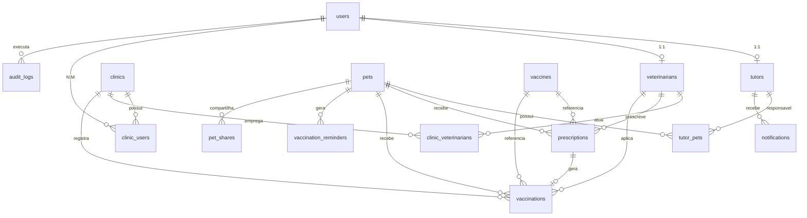

**# Modelo de Dados Físico e Contratos de API**

**## Carteira Digital de Vacinação de Pets — v1.0**

**Versão:** 1.0  

**Data:** 27/07/2026  

**Status:** Rascunho para validação técnica  

**Base URL da API:** `https://api.petvacina.com.br/v1`

**---**

**## Parte 1 — Modelo de Dados Físico**

**SGBD sugerido:** PostgreSQL 15+

**Convenções:**

- PKs: `UUID` `gen_random_uuid()`)

- Timestamps: `TIMESTAMPTZ` (UTC)

- Soft delete: coluna `deleted_at`

- Auditoria: `created_at`, `updated_at`, `created_by`, `updated_by`

- Nomes: `snake_case`, tabelas no plural

---

### **1.1 Diagrama físico (ER)**

Você pode visualizar a representação visual interativa do diagrama físico diretamente abrindo o arquivo [database_diagram.svg](file:///d:/Dev/database_diagram.svg) no seu navegador ou editor de sua preferência.

<b>Ver código Mermaid original</b>

---

### **1.2 Tipos enumerados (ENUMs)**

CREATE TYPE user_role AS ENUM (

'platform_admin',

'clinic_admin',

'veterinarian',

'receptionist',

'tutor'

);

CREATE TYPE user_status AS ENUM ('active', 'inactive', 'pending', 'blocked');

CREATE TYPE pet_species AS ENUM ('dog', 'cat', 'bird', 'reptile', 'other');

CREATE TYPE pet_sex AS ENUM ('male', 'female', 'unknown');

CREATE TYPE pet_status AS ENUM ('active', 'deceased', 'transferred', 'archived');

CREATE TYPE prescription_status AS ENUM (

'pending', 'scheduled', 'applied', 'cancelled', 'no_show'

);

CREATE TYPE vaccination_status AS ENUM ('confirmed', 'rectified', 'voided');

CREATE TYPE share_permission AS ENUM ('read', 'read_export');

CREATE TYPE notification_channel AS ENUM ('push', 'email', 'sms');

CREATE TYPE notification_status AS ENUM ('pending', 'sent', 'failed', 'read');

CREATE TYPE consent_type AS ENUM (

'terms_of_use',

'privacy_policy',

'data_sharing_clinic',

'marketing'

);

CREATE TYPE clinic_user_role AS ENUM ('admin', 'receptionist');

---

### **1.3 Tabela** `users`

Usuário base de autenticação (todos os perfis).

| **Coluna**        | **Tipo**     | **Restrições**             | **Descrição**        |
| ----------------- | ------------ | -------------------------- | -------------------- |
| id                | UUID         | PK                         | Identificador        |
| email             | VARCHAR(255) | UNIQUE, NOT NULL           | Login                |
| password_hash     | VARCHAR(255) | NULL                       | Null se login social |
| role              | user_role    | NOT NULL                   | Perfil principal     |
| status            | user_status  | NOT NULL DEFAULT 'pending' | Estado da conta      |
| email_verified_at | TIMESTAMPTZ  | NULL                       | Confirmação e-mail   |
| mfa_enabled       | BOOLEAN      | NOT NULL DEFAULT false     | 2FA                  |
| mfa_secret        | VARCHAR(255) | NULL                       | TOTP secret          |
| last_login_at     | TIMESTAMPTZ  | NULL                       | Último acesso        |
| created_at        | TIMESTAMPTZ  | NOT NULL DEFAULT now()     |                      |
| updated_at        | TIMESTAMPTZ  | NOT NULL DEFAULT now()     |                      |
| deleted_at        | TIMESTAMPTZ  | NULL                       | Soft delete          |

**Índices:** `idx_users_email`, `idx_users_role_status`

---

### **1.4 Tabela** `tutors`

| **Coluna** | **Tipo**     | **Restrições**                   | **Descrição**  |
| ---------- | ------------ | -------------------------------- | -------------- |
| id         | UUID         | PK                               |                |
| user_id    | UUID         | FK → users(id), UNIQUE, NOT NULL |                |
| full_name  | VARCHAR(200) | NOT NULL                         |                |
| cpf        | VARCHAR(11)  | UNIQUE, NOT NULL                 | Apenas dígitos |
| phone      | VARCHAR(20)  | NULL                             |                |
| avatar_url | VARCHAR(500) | NULL                             |                |
| created_at | TIMESTAMPTZ  | NOT NULL DEFAULT now()           |                |
| updated_at | TIMESTAMPTZ  | NOT NULL DEFAULT now()           |                |

**Índices:** `idx_tutors_cpf`, `idx_tutors_user_id`

---

### **1.5 Tabela** `veterinarians`

| **Coluna**    | **Tipo**     | **Restrições**                   | **Descrição**           |
| ------------- | ------------ | -------------------------------- | ----------------------- |
| id            | UUID         | PK                               |                         |
| user_id       | UUID         | FK → users(id), UNIQUE, NOT NULL |                         |
| full_name     | VARCHAR(200) | NOT NULL                         |                         |
| crmv          | VARCHAR(20)  | UNIQUE, NOT NULL                 | Ex: SP-12345            |
| crmv_state    | CHAR(2)      | NOT NULL                         | UF do CRMV              |
| specialty     | VARCHAR(100) | NULL                             |                         |
| signature_url | VARCHAR(500) | NULL                             | Assinatura digitalizada |
| created_at    | TIMESTAMPTZ  | NOT NULL DEFAULT now()           |                         |
| updated_at    | TIMESTAMPTZ  | NOT NULL DEFAULT now()           |                         |

**Índices:** `idx_veterinarians_crmv`, `idx_veterinarians_user_id`

---

### **1.6 Tabela** `clinics`

| **Coluna**   | **Tipo**      | **Restrições**         | **Descrição**  |
| ------------ | ------------- | ---------------------- | -------------- |
| id           | UUID          | PK                     |                |
| cnpj         | VARCHAR(14)   | UNIQUE, NOT NULL       | Apenas dígitos |
| legal_name   | VARCHAR(255)  | NOT NULL               | Razão social   |
| trade_name   | VARCHAR(255)  | NULL                   | Nome fantasia  |
| email        | VARCHAR(255)  | NOT NULL               |                |
| phone        | VARCHAR(20)   | NULL                   |                |
| logo_url     | VARCHAR(500)  | NULL                   |                |
| street       | VARCHAR(255)  | NOT NULL               |                |
| number       | VARCHAR(20)   | NOT NULL               |                |
| complement   | VARCHAR(100)  | NULL                   |                |
| neighborhood | VARCHAR(100)  | NOT NULL               |                |
| city         | VARCHAR(100)  | NOT NULL               |                |
| state        | CHAR(2)       | NOT NULL               |                |
| zip_code     | VARCHAR(8)    | NOT NULL               |                |
| latitude     | DECIMAL(10,8) | NULL                   | Geolocalização |
| longitude    | DECIMAL(11,8) | NULL                   |                |
| is_active    | BOOLEAN       | NOT NULL DEFAULT true  |                |
| created_at   | TIMESTAMPTZ   | NOT NULL DEFAULT now() |                |
| updated_at   | TIMESTAMPTZ   | NOT NULL DEFAULT now() |                |
| deleted_at   | TIMESTAMPTZ   | NULL                   |                |

**Índices:** `idx_clinics_cnpj`, `idx_clinics_city_state`, `idx_clinics_geo` (GIST, fase 2)

---

### **1.7 Tabela** `clinic_users`

Vínculo usuário ↔ clínica (admin, recepção).

| **Coluna**  | **Tipo**         | **Restrições**             |
| ----------- | ---------------- | -------------------------- |
| id          | UUID             | PK                         |
| clinic_id   | UUID             | FK → clinics(id), NOT NULL |
| user_id     | UUID             | FK → users(id), NOT NULL   |
| role        | clinic_user_role | NOT NULL                   |
| is_active   | BOOLEAN          | NOT NULL DEFAULT true      |
| invited_at  | TIMESTAMPTZ      | NULL                       |
| accepted_at | TIMESTAMPTZ      | NULL                       |
| created_at  | TIMESTAMPTZ      | NOT NULL DEFAULT now()     |

**UNIQUE:** `(clinic_id, user_id)`

---

### **1.8 Tabela** `clinic_veterinarians`

| **Coluna**      | **Tipo**    | **Restrições**                   |
| --------------- | ----------- | -------------------------------- |
| id              | UUID        | PK                               |
| clinic_id       | UUID        | FK → clinics(id), NOT NULL       |
| veterinarian_id | UUID        | FK → veterinarians(id), NOT NULL |
| is_active       | BOOLEAN     | NOT NULL DEFAULT true            |
| invited_at      | TIMESTAMPTZ | NULL                             |
| accepted_at     | TIMESTAMPTZ | NULL                             |
| created_at      | TIMESTAMPTZ | NOT NULL DEFAULT now()           |

**UNIQUE:** `(clinic_id, veterinarian_id)`

---

### **1.9 Tabela** `pets`

| **Coluna**  | **Tipo**     | **Restrições**             | **Descrição**                   |
| ----------- | ------------ | -------------------------- | ------------------------------- |
| id          | UUID         | PK                         |                                 |
| public_code | VARCHAR(12)  | UNIQUE, NOT NULL           | Código legível (ex: PET-A1B2C3) |
| name        | VARCHAR(100) | NOT NULL                   |                                 |
| species     | pet_species  | NOT NULL                   |                                 |
| breed       | VARCHAR(100) | NULL                       |                                 |
| sex         | pet_sex      | NOT NULL DEFAULT 'unknown' |                                 |
| birth_date  | DATE         | NULL                       |                                 |
| weight_kg   | DECIMAL(5,2) | NULL                       |                                 |
| microchip   | VARCHAR(50)  | NULL, UNIQUE               |                                 |
| photo_url   | VARCHAR(500) | NULL                       |                                 |
| status      | pet_status   | NOT NULL DEFAULT 'active'  |                                 |
| created_at  | TIMESTAMPTZ  | NOT NULL DEFAULT now()     |                                 |
| updated_at  | TIMESTAMPTZ  | NOT NULL DEFAULT now()     |                                 |
| deleted_at  | TIMESTAMPTZ  | NULL                       |                                 |

**Índices:** `idx_pets_public_code`, `idx_pets_microchip`, `idx_pets_status`

---

### **1.10 Tabela** `tutor_pets`

Relacionamento N:N tutor ↔ pet.

| **Coluna**   | **Tipo**    | **Restrições**            | **Descrição**             |
| ------------ | ----------- | ------------------------- | ------------------------- |
| id           | UUID        | PK                        |                           |
| tutor_id     | UUID        | FK → tutors(id), NOT NULL |                           |
| pet_id       | UUID        | FK → pets(id), NOT NULL   |                           |
| is_primary   | BOOLEAN     | NOT NULL DEFAULT false    | Tutor principal           |
| relationship | VARCHAR(50) | NULL                      | owner, co_owner, guardian |
| created_at   | TIMESTAMPTZ | NOT NULL DEFAULT now()    |                           |

**UNIQUE:** `(tutor_id, pet_id)`

**Regra:** exatamente 1 `is_primary = true` por pet:

CREATE UNIQUE INDEX idx_tutor_pets_one_primary

ON tutor_pets (pet_id)

WHERE is_primary = true;

---

### **1.11 Tabela** `pet_shares`

Compartilhamento com co-tutor convidado.

| **Coluna**     | **Tipo**         | **Restrições**            |
| -------------- | ---------------- | ------------------------- |
| id             | UUID             | PK                        |
| pet_id         | UUID             | FK → pets(id), NOT NULL   |
| owner_tutor_id | UUID             | FK → tutors(id), NOT NULL |
| guest_tutor_id | UUID             | FK → tutors(id), NULL     |
| guest_email    | VARCHAR(255)     | NOT NULL                  |
| permission     | share_permission | NOT NULL DEFAULT 'read'   |
| token          | VARCHAR(64)      | UNIQUE, NOT NULL          |
| expires_at     | TIMESTAMPTZ      | NOT NULL                  |
| accepted_at    | TIMESTAMPTZ      | NULL                      |
| revoked_at     | TIMESTAMPTZ      | NULL                      |
| created_at     | TIMESTAMPTZ      | NOT NULL DEFAULT now()    |

---

### **1.12 Tabela** `clinic_pet_consents`

Autorização LGPD tutor → clínica.

| **Coluna** | **Tipo**    | **Restrições**             |
| ---------- | ----------- | -------------------------- |
| id         | UUID        | PK                         |
| clinic_id  | UUID        | FK → clinics(id), NOT NULL |
| pet_id     | UUID        | FK → pets(id), NOT NULL    |
| tutor_id   | UUID        | FK → tutors(id), NOT NULL  |
| granted_at | TIMESTAMPTZ | NOT NULL DEFAULT now()     |
| revoked_at | TIMESTAMPTZ | NULL                       |
| ip_address | INET        | NULL                       |

**UNIQUE ativo:** `(clinic_id, pet_id)` WHERE `revoked_at IS NULL`

---

### **1.13 Tabela** `vaccines`

Catálogo central de vacinas.

| **Coluna**   | **Tipo**      | **Restrições**         | **Descrição**        |
| ------------ | ------------- | ---------------------- | -------------------- |
| id           | UUID          | PK                     |                      |
| name         | VARCHAR(150)  | NOT NULL               | Ex: V10, Antirrábica |
| manufacturer | VARCHAR(150)  | NULL                   |                      |
| species      | pet_species[] | NOT NULL               | Espécies aplicáveis  |
| description  | TEXT          | NULL                   |                      |
| is_active    | BOOLEAN       | NOT NULL DEFAULT true  |                      |
| created_at   | TIMESTAMPTZ   | NOT NULL DEFAULT now() |                      |
| updated_at   | TIMESTAMPTZ   | NOT NULL DEFAULT now() |                      |

---

### **1.14 Tabela** `vaccine_protocols`

Esquema de doses por vacina.

| **Coluna**    | **Tipo**    | **Restrições**              | **Descrição**              |
| ------------- | ----------- | --------------------------- | -------------------------- |
| id            | UUID        | PK                          |                            |
| vaccine_id    | UUID        | FK → vaccines(id), NOT NULL |                            |
| dose_number   | SMALLINT    | NOT NULL                    | 1, 2, 3...                 |
| min_age_days  | INT         | NULL                        | Idade mínima               |
| interval_days | INT         | NULL                        | Intervalo até próxima dose |
| is_booster    | BOOLEAN     | NOT NULL DEFAULT false      |                            |
| notes         | TEXT        | NULL                        |                            |
| created_at    | TIMESTAMPTZ | NOT NULL DEFAULT now()      |                            |

**UNIQUE:** `(vaccine_id, dose_number)`

---

### **1.15 Tabela** `clinic_vaccines`

Vacinas habilitadas por clínica.

| **Coluna**   | **Tipo**    | **Restrições**              |
| ------------ | ----------- | --------------------------- |
| id           | UUID        | PK                          |
| clinic_id    | UUID        | FK → clinics(id), NOT NULL  |
| vaccine_id   | UUID        | FK → vaccines(id), NOT NULL |
| is_available | BOOLEAN     | NOT NULL DEFAULT true       |
| created_at   | TIMESTAMPTZ | NOT NULL DEFAULT now()      |

**UNIQUE:** `(clinic_id, vaccine_id)`

---

### **1.16 Tabela** `prescriptions`

| **Coluna**      | **Tipo**            | **Restrições**                   | **Descrição** |
| --------------- | ------------------- | -------------------------------- | ------------- |
| id              | UUID                | PK                               |               |
| pet_id          | UUID                | FK → pets(id), NOT NULL          |               |
| vaccine_id      | UUID                | FK → vaccines(id), NOT NULL      |               |
| veterinarian_id | UUID                | FK → veterinarians(id), NOT NULL |               |
| clinic_id       | UUID                | FK → clinics(id), NOT NULL       |               |
| dose_number     | SMALLINT            | NOT NULL DEFAULT 1               |               |
| status          | prescription_status | NOT NULL DEFAULT 'pending'       |               |
| prescribed_at   | TIMESTAMPTZ         | NOT NULL DEFAULT now()           |               |
| scheduled_at    | DATE                | NULL                             | Data prevista |
| notes           | TEXT                | NULL                             |               |
| created_at      | TIMESTAMPTZ         | NOT NULL DEFAULT now()           |               |
| updated_at      | TIMESTAMPTZ         | NOT NULL DEFAULT now()           |               |

**Índices:** `idx_prescriptions_pet_id`, `idx_prescriptions_status`, `idx_prescriptions_scheduled_at`

---

### **1.17 Tabela** `vaccinations`

Registro de aplicação efetiva.

| **Coluna**       | **Tipo**           | **Restrições**                   | **Descrição**             |
| ---------------- | ------------------ | -------------------------------- | ------------------------- |
| id               | UUID               | PK                               |                           |
| prescription_id  | UUID               | FK → prescriptions(id), NULL     | Pode ser aplicação direta |
| pet_id           | UUID               | FK → pets(id), NOT NULL          |                           |
| vaccine_id       | UUID               | FK → vaccines(id), NOT NULL      |                           |
| veterinarian_id  | UUID               | FK → veterinarians(id), NOT NULL |                           |
| clinic_id        | UUID               | FK → clinics(id), NOT NULL       |                           |
| dose_number      | SMALLINT           | NOT NULL                         |                           |
| batch_number     | VARCHAR(50)        | NOT NULL                         | Lote                      |
| batch_expiry     | DATE               | NOT NULL                         | Validade do lote          |
| application_site | VARCHAR(100)       | NULL                             | Ex: subcutânea, coxa esq. |
| applied_at       | TIMESTAMPTZ        | NOT NULL                         | Data/hora aplicação       |
| status           | vaccination_status | NOT NULL DEFAULT 'confirmed'     |                           |
| next_dose_at     | DATE               | NULL                             | Calculado                 |
| certificate_url  | VARCHAR(500)       | NULL                             | PDF gerado                |
| qr_code_token    | VARCHAR(64)        | UNIQUE, NULL                     | Verificação pública       |
| notes            | TEXT               | NULL                             |                           |
| created_at       | TIMESTAMPTZ        | NOT NULL DEFAULT now()           |                           |
| updated_at       | TIMESTAMPTZ        | NOT NULL DEFAULT now()           |                           |

**Índices:** `idx_vaccinations_pet_id`, `idx_vaccinations_applied_at`, `idx_vaccinations_qr_code_token`

---

### **1.18 Tabela** `vaccination_rectifications`

Retificação auditada (substitui edição direta).

| **Coluna**     | **Tipo**    | **Restrições**                  |
| -------------- | ----------- | ------------------------------- |
| id             | UUID        | PK                              |
| vaccination_id | UUID        | FK → vaccinations(id), NOT NULL |
| rectified_by   | UUID        | FK → users(id), NOT NULL        |
| reason         | TEXT        | NOT NULL                        |
| previous_data  | JSONB       | NOT NULL                        |
| new_data       | JSONB       | NOT NULL                        |
| created_at     | TIMESTAMPTZ | NOT NULL DEFAULT now()          |

---

### **1.19 Tabela** `vaccination_reminders`

| **Coluna**      | **Tipo**             | **Restrições**               |
| --------------- | -------------------- | ---------------------------- |
| id              | UUID                 | PK                           |
| pet_id          | UUID                 | FK → pets(id), NOT NULL      |
| tutor_id        | UUID                 | FK → tutors(id), NOT NULL    |
| vaccination_id  | UUID                 | FK → vaccinations(id), NULL  |
| prescription_id | UUID                 | FK → prescriptions(id), NULL |
| vaccine_id      | UUID                 | FK → vaccines(id), NOT NULL  |
| remind_at       | TIMESTAMPTZ          | NOT NULL                     |
| channel         | notification_channel | NOT NULL                     |
| status          | notification_status  | NOT NULL DEFAULT 'pending'   |
| sent_at         | TIMESTAMPTZ          | NULL                         |
| created_at      | TIMESTAMPTZ          | NOT NULL DEFAULT now()       |

**Índices:** `idx_reminders_remind_at_status`

---

### **1.20 Tabela** `notifications`

| **Coluna**     | **Tipo**             | **Restrições**             |
| -------------- | -------------------- | -------------------------- |
| id             | UUID                 | PK                         |
| user_id        | UUID                 | FK → users(id), NOT NULL   |
| title          | VARCHAR(200)         | NOT NULL                   |
| body           | TEXT                 | NOT NULL                   |
| type           | VARCHAR(50)          | NOT NULL                   |
| reference_type | VARCHAR(50)          | NULL                       |
| reference_id   | UUID                 | NULL                       |
| channel        | notification_channel | NOT NULL                   |
| status         | notification_status  | NOT NULL DEFAULT 'pending' |
| read_at        | TIMESTAMPTZ          | NULL                       |
| created_at     | TIMESTAMPTZ          | NOT NULL DEFAULT now()     |

---

### **1.21 Tabela** `consents`

Registro LGPD.

| **Coluna**   | **Tipo**     | **Restrições**           |
| ------------ | ------------ | ------------------------ |
| id           | UUID         | PK                       |
| user_id      | UUID         | FK → users(id), NOT NULL |
| consent_type | consent_type | NOT NULL                 |
| version      | VARCHAR(20)  | NOT NULL                 |
| granted      | BOOLEAN      | NOT NULL                 |
| ip_address   | INET         | NULL                     |
| user_agent   | TEXT         | NULL                     |
| granted_at   | TIMESTAMPTZ  | NOT NULL DEFAULT now()   |
| revoked_at   | TIMESTAMPTZ  | NULL                     |

---

### **1.22 Tabela** `audit_logs`

| **Coluna**  | **Tipo**    | **Restrições**         |
| ----------- | ----------- | ---------------------- |
| id          | UUID        | PK                     |
| user_id     | UUID        | FK → users(id), NULL   |
| entity_type | VARCHAR(50) | NOT NULL               |
| entity_id   | UUID        | NOT NULL               |
| action      | VARCHAR(50) | NOT NULL               |
| old_values  | JSONB       | NULL                   |
| new_values  | JSONB       | NULL                   |
| ip_address  | INET        | NULL                   |
| created_at  | TIMESTAMPTZ | NOT NULL DEFAULT now() |

**Índices:** `idx_audit_entity`, `idx_audit_user_id`, `idx_audit_created_at`

---

### **1.23 Tabela** `refresh_tokens`

| **Coluna**  | **Tipo**     | **Restrições**           |
| ----------- | ------------ | ------------------------ |
| id          | UUID         | PK                       |
| user_id     | UUID         | FK → users(id), NOT NULL |
| token_hash  | VARCHAR(255) | UNIQUE, NOT NULL         |
| device_info | VARCHAR(255) | NULL                     |
| expires_at  | TIMESTAMPTZ  | NOT NULL                 |
| revoked_at  | TIMESTAMPTZ  | NULL                     |
| created_at  | TIMESTAMPTZ  | NOT NULL DEFAULT now()   |

---

### **1.24 Regras de integridade (DB)**

| **Regra**                         | **Implementação**                                                                                            |
| --------------------------------- | ------------------------------------------------------------------------------------------------------------ |
| Pet deve ter 1 tutor principal    | Partial unique index em `tutor_pets`                                                                         |
| Aplicação exige lote e validade   | `NOT NULL` em `batch_number`, `batch_expiry`                                                                 |
| CRMV único                        | UNIQUE em `veterinarians.crmv`                                                                               |
| CNPJ único                        | UNIQUE em `clinics.cnpj`                                                                                     |
| Consentimento clínica ativo único | Partial unique index                                                                                         |
| Registro confirmado imutável      | Trigger bloqueia UPDATE em `vaccinations` WHERE status = 'confirmed' (exceto certificate_url, qr_code_token) |
| Soft delete em cascata lógica     | Pets arquivados não recebem novas prescrições (CHECK no app + constraint)                                    |

---

### **1.25 Script DDL resumido (referência)**

CREATE EXTENSION IF NOT EXISTS "pgcrypto";

CREATE TABLE users (

  id UUID PRIMARY KEY DEFAULT gen_random_uuid(),

  email VARCHAR(255) NOT NULL UNIQUE,

  password_hash VARCHAR(255),

role user_role NOT NULL,

status user_status NOT NULL DEFAULT 'pending',

  email_verified_at TIMESTAMPTZ,

  mfa_enabled BOOLEAN NOT NULL DEFAULT false,

  last_login_at TIMESTAMPTZ,

  created_at TIMESTAMPTZ NOT NULL DEFAULT now(),

  updated_at TIMESTAMPTZ NOT NULL DEFAULT now(),

  deleted_at TIMESTAMPTZ

);

CREATE TABLE pets (

  id UUID PRIMARY KEY DEFAULT gen_random_uuid(),

  public_code VARCHAR(12) NOT NULL UNIQUE,

name VARCHAR(100) NOT NULL,

  species pet_species NOT NULL,

  breed VARCHAR(100),

  sex pet_sex NOT NULL DEFAULT 'unknown',

  birth_date DATE,

  weight_kg DECIMAL(5,2),

  microchip VARCHAR(50) UNIQUE,

  photo_url VARCHAR(500),

status pet_status NOT NULL DEFAULT 'active',

  created_at TIMESTAMPTZ NOT NULL DEFAULT now(),

  updated_at TIMESTAMPTZ NOT NULL DEFAULT now(),

  deleted_at TIMESTAMPTZ

);

*-- Demais tabelas seguem o mapeamento das seções 1.3–1.23*

---

## **Parte 2 — Contratos de API**

**Estilo:** REST  
**Formato:** JSON (`Content-Type: application/json`)  
**Autenticação:** Bearer JWT (`Authorization: Bearer <access_token>`)  
**Versionamento:** prefixo `/v1` na URL  
**Charset:** UTF-8  
**Datas:** ISO 8601 (`2026-07-27T10:30:00-03:00`)

---

### **2.1 Convenções gerais**

#### **Paginação**

GET /resources?page=1&limit=20

Resposta:

{

"data": [],

"meta": {

"page": 1,

"limit": 20,

"total": 150,

"totalPages": 8

}

}

#### **Ordenação e filtros**

GET /pets?sort=-created_at&species=dog&status=active

#### **Resposta de erro padrão**

{

"error": {

"code": "VALIDATION_ERROR",

"message": "Dados inválidos",

"details": [

{ "field": "cpf", "message": "CPF inválido" }

],

"traceId": "abc-123-def"

}

}

#### **Códigos HTTP**

| **Código** | **Uso**                        |
| ---------- | ------------------------------ |
| 200        | Sucesso (GET, PUT, PATCH)      |
| 201        | Criado (POST)                  |
| 204        | Sem conteúdo (DELETE)          |
| 400        | Validação / regra de negócio   |
| 401        | Não autenticado                |
| 403        | Sem permissão                  |
| 404        | Recurso não encontrado         |
| 409        | Conflito (CNPJ/CRMV duplicado) |
| 422        | Entidade não processável       |
| 429        | Rate limit                     |
| 500        | Erro interno                   |

---

### **2.2 Autenticação (**`/auth`**)**

#### **POST** `/auth/register`

Cadastro de tutor (outros perfis via convite).

**Request:**

{

"email": "maria@email.com",

"password": "SenhaForte123!",

"fullName": "Maria Silva",

"cpf": "12345678901",

"phone": "11999998888",

"consents": [

{ "type": "terms_of_use", "version": "1.0", "granted": true },

{ "type": "privacy_policy", "version": "1.0", "granted": true }

]

}

**Response 201:**

{

"data": {

"userId": "uuid",

"email": "maria@email.com",

"role": "tutor",

"status": "pending"

}

}

---

#### **POST** `/auth/login`

**Request:**

{

"email": "maria@email.com",

"password": "SenhaForte123!",

"mfaCode": "123456"

}

**Response 200:**

{

"data": {

"accessToken": "eyJhbG...",

"refreshToken": "dGhpcy...",

"expiresIn": 3600,

"user": {

"id": "uuid",

"email": "maria@email.com",

"role": "tutor",

"fullName": "Maria Silva"

}

}

}

---

#### **POST** `/auth/refresh`

**Request:** `{ "refreshToken": "dGhpcy..." }`  
**Response 200:** novo par access/refresh token.

---

#### **POST** `/auth/forgot-password`

**Request:** `{ "email": "maria@email.com" }`  
**Response 200:** `{ "message": "E-mail enviado se conta existir" }`

---

#### **POST** `/auth/reset-password`

**Request:**

{

"token": "reset-token",

"newPassword": "NovaSenha123!"

}

---

#### **POST** `/auth/logout`

**Request:** `{ "refreshToken": "dGhpcy..." }`  
**Response 204**

---

### **2.3 Tutores (**`/tutors`**)**

#### **GET** `/tutors/me`

Retorna perfil do tutor autenticado.

**Response 200:**

{

"data": {

"id": "uuid",

"fullName": "Maria Silva",

"cpf": "12345678901",

"phone": "11999998888",

"email": "maria@email.com",

"avatarUrl": null,

"petsCount": 3

}

}

---

#### **PATCH** `/tutors/me`

**Request:**

{

"fullName": "Maria Silva",

"phone": "11988887777",

"avatarUrl": "https://..."

}

---

### **2.4 Pets (**`/pets`**)**

#### **GET** `/pets`

Lista pets do tutor autenticado.

**Query:** `?status=active&species=dog`

**Response 200:**

{

"data": [

{

"id": "uuid",

"publicCode": "PET-A1B2C3",

"name": "Thor",

"species": "dog",

"breed": "SRD",

"sex": "male",

"birthDate": "2020-03-15",

"photoUrl": null,

"status": "active",

"vaccinationStatus": "up_to_date",

"nextReminder": {

"vaccineName": "Antirrábica",

"dueDate": "2026-09-15"

}

}

],

"meta": { "page": 1, "limit": 20, "total": 3, "totalPages": 1 }

}

**Valores** `vaccinationStatus`**:** `up_to_date` | `pending` | `overdue` | `unknown`

---

#### **POST** `/pets`

**Request:**

{

"name": "Thor",

"species": "dog",

"breed": "SRD",

"sex": "male",

"birthDate": "2020-03-15",

"weightKg": 12.5,

"microchip": null,

"photoUrl": null

}

**Response 201:**

{

"data": {

"id": "uuid",

"publicCode": "PET-A1B2C3",

"name": "Thor",

"species": "dog",

"status": "active",

"createdAt": "2026-07-27T10:30:00-03:00"

}

}

---

#### **GET** `/pets/{petId}`

Detalhe do pet (requer vínculo tutor ou consentimento clínica).

---

#### **PATCH** `/pets/{petId}`

Atualização parcial. Tutor principal only.

---

#### **DELETE** `/pets/{petId}`

Soft delete / arquivar. Tutor principal only.

---

#### **GET** `/pets/{petId}/wallet`

Carteira de vacinação completa.

**Response 200:**

{

"data": {

"pet": {

"id": "uuid",

"publicCode": "PET-A1B2C3",

"name": "Thor",

"species": "dog",

"breed": "SRD",

"birthDate": "2020-03-15",

"photoUrl": null

},

"summary": {

"status": "pending",

"totalApplied": 5,

"totalPending": 1,

"totalOverdue": 0

},

"entries": [

{

"type": "vaccination",

"id": "uuid",

"vaccine": {

"id": "uuid",

"name": "V10",

"manufacturer": "Fabricante X"

},

"doseNumber": 1,

"status": "confirmed",

"appliedAt": "2026-01-10T14:00:00-03:00",

"batchNumber": "LOT123",

"batchExpiry": "2027-01-10",

"nextDoseAt": "2026-02-10",

"veterinarian": {

"fullName": "Dr. Ricardo",

"crmv": "SP-12345"

},

"clinic": {

"tradeName": "Clínica PetCare",

"cnpj": "12345678000199"

},

"certificateUrl": "https://...",

"qrCodeToken": "abc123"

},

{

"type": "prescription",

"id": "uuid",

"vaccine": { "id": "uuid", "name": "Antirrábica" },

"doseNumber": 1,

"status": "pending",

"scheduledAt": "2026-09-15",

"prescribedAt": "2026-07-27T10:00:00-03:00"

}

]

}

}

---

#### **GET** `/pets/{petId}/wallet/export`

Exporta PDF da carteira.

**Response 200:**

{

"data": {

"downloadUrl": "https://storage.../wallet-PET-A1B2C3.pdf",

"expiresAt": "2026-07-27T11:30:00-03:00"

}

}

---

#### **POST** `/pets/{petId}/shares`

Convidar co-tutor.

**Request:**

{

"guestEmail": "joao@email.com",

"permission": "read",

"expiresInHours": 72

}

**Response 201:**

{

"data": {

"id": "uuid",

"guestEmail": "joao@email.com",

"permission": "read",

"token": "invite-token",

"expiresAt": "2026-07-30T10:30:00-03:00"

}

}

---

#### **POST** `/pets/shares/accept`

**Request:** `{ "token": "invite-token" }`

---

### **2.5 Clínicas (**`/clinics`**)**

#### **POST** `/clinics`

Cadastro de clínica (platform_admin ou fluxo self-service).

**Request:**

{

"cnpj": "12345678000199",

"legalName": "Clínica PetCare LTDA",

"tradeName": "PetCare",

"email": "contato@petcare.com",

"phone": "1133334444",

"address": {

"street": "Rua das Flores",

"number": "100",

"complement": "Sala 2",

"neighborhood": "Centro",

"city": "São Paulo",

"state": "SP",

"zipCode": "01001000"

}

}

---

#### **GET** `/clinics/{clinicId}`

Detalhe da clínica.

---

#### **PATCH** `/clinics/{clinicId}`

Admin da clínica only.

---

#### **GET** `/clinics/search`

**Query:** `?q=PetCare&city=São Paulo&state=SP&lat=-23.55&lng=-46.63&radiusKm=10`

---

#### **POST** `/clinics/{clinicId}/invites/veterinarians`

**Request:**

{

"email": "dr.ricardo@email.com",

"crmv": "SP-12345"

}

---

#### **POST** `/clinics/{clinicId}/invites/staff`

Convite recepção/admin.

**Request:**

{

"email": "ana@petcare.com",

"role": "receptionist"

}

---

#### **GET** `/clinics/{clinicId}/vaccinations/report`

Relatório de vacinações.

**Query:** `?from=2026-07-01&to=2026-07-31&vaccineId=uuid`

**Response 200:**

{

"data": {

"period": { "from": "2026-07-01", "to": "2026-07-31" },

"total": 142,

"byVaccine": [

{ "vaccineName": "V10", "count": 80 },

{ "vaccineName": "Antirrábica", "count": 62 }

],

"byVeterinarian": [

{ "veterinarianName": "Dr. Ricardo", "crmv": "SP-12345", "count": 95 }

]

}

}

---

### **2.6 Veterinários (**`/veterinarians`**)**

#### **GET** `/veterinarians/me`

Perfil do veterinário autenticado + clínicas vinculadas.

---

#### **POST** `/veterinarians/invites/accept`

Aceitar convite de clínica.

**Request:** `{ "token": "clinic-invite-token" }`

---

#### **GET** `/veterinarians/me/pending-prescriptions`

Prescrições pendentes do veterinário.

**Query:** `?clinicId=uuid&date=2026-07-27`

---

### **2.7 Prescrições (**`/prescriptions`**)**

#### **POST** `/prescriptions`

**Auth:** veterinário

**Request:**

{

"petId": "uuid",

"clinicId": "uuid",

"vaccineId": "uuid",

"doseNumber": 1,

"scheduledAt": "2026-08-15",

"notes": "Primeira dose"

}

**Response 201:**

{

"data": {

"id": "uuid",

"petId": "uuid",

"vaccineId": "uuid",

"status": "pending",

"prescribedAt": "2026-07-27T10:30:00-03:00",

"scheduledAt": "2026-08-15"

}

}

**Erros:**

- `403` — sem consentimento LGPD tutor/clínica
- `404` — pet ou vacina não encontrados
- `422` — pet arquivado/falecido

---

#### **GET** `/prescriptions/{prescriptionId}`

---

#### **PATCH** `/prescriptions/{prescriptionId}`

Atualizar status (cancelar, agendar).

**Request:**

{

"status": "cancelled",

"notes": "Tutor desistiu"

}

---

### **2.8 Vacinações (**`/vaccinations`**)**

#### **POST** `/vaccinations`

Registro de aplicação.

**Auth:** veterinário

**Request:**

{

"prescriptionId": "uuid",

"petId": "uuid",

"clinicId": "uuid",

"vaccineId": "uuid",

"doseNumber": 1,

"batchNumber": "LOT123456",

"batchExpiry": "2027-06-30",

"applicationSite": "subcutânea - nuca",

"appliedAt": "2026-07-27T10:45:00-03:00",

"notes": null

}

**Response 201:**

{

"data": {

"id": "uuid",

"status": "confirmed",

"appliedAt": "2026-07-27T10:45:00-03:00",

"nextDoseAt": "2026-08-27",

"certificateUrl": "https://storage.../cert-uuid.pdf",

"qrCodeToken": "verify-abc123",

"prescriptionId": "uuid"

}

}

**Regras validadas:**

- `batchExpiry` >= data aplicação
- `prescriptionId` vincula e atualiza status para `applied`
- Calcula `nextDoseAt` via `vaccine_protocols`

---

#### **GET** `/vaccinations/{vaccinationId}`

Detalhe com dados completos.

---

#### **POST** `/vaccinations/{vaccinationId}/rectify`

Retificação auditada (não edição direta).

**Request:**

{

"reason": "Lote informado incorretamente",

"batchNumber": "LOT654321",

"batchExpiry": "2027-08-30"

}

**Response 201:**

{

"data": {

"vaccinationId": "uuid",

"status": "rectified",

"rectificationId": "uuid",

"updatedFields": ["batchNumber", "batchExpiry"]

}

}

---

#### **GET** `/vaccinations/verify/{qrCodeToken}`

Verificação pública limitada (sem auth).

**Response 200:**

{

"data": {

"valid": true,

"petName": "Thor",

"species": "dog",

"vaccineName": "V10",

"doseNumber": 1,

"appliedAt": "2026-07-27T10:45:00-03:00",

"veterinarianCrmv": "SP-12345",

"clinicName": "PetCare",

"status": "confirmed"

}

}

---

### **2.9 Catálogo de vacinas (**`/vaccines`**)**

#### **GET** `/vaccines`

**Query:** `?species=dog&isActive=true`

**Response 200:**

{

"data": [

{

"id": "uuid",

"name": "V10",

"manufacturer": "Fabricante X",

"species": ["dog"],

"protocol": [

{ "doseNumber": 1, "minAgeDays": 45, "intervalDays": 21 },

{ "doseNumber": 2, "minAgeDays": null, "intervalDays": 21 },

{ "doseNumber": 3, "minAgeDays": null, "intervalDays": 365, "isBooster": true }

]

}

]

}

---

#### **POST** `/vaccines`

Platform admin only.

---

#### **PATCH** `/vaccines/{vaccineId}`

Platform admin only.

---

### **2.10 Consentimentos (**`/consents`**)**

#### **POST** `/consents/clinic-access`

Tutor autoriza clínica a acessar pet.

**Request:**

{

"clinicId": "uuid",

"petId": "uuid"

}

---

#### **DELETE** `/consents/clinic-access/{consentId}`

Revogar consentimento.

---

#### **GET** `/consents/clinic-access`

Lista consentimentos do tutor autenticado.

---

### **2.11 Busca operacional (**`/search`**)**

#### **GET** `/search/pets`

**Auth:** veterinário, recepção, admin clínica  
**Query:** `?q=thor&cpf=12345678901&publicCode=PET-A1B2C3&clinicId=uuid`

**Response 200:**

{

"data": [

{

"id": "uuid",

"publicCode": "PET-A1B2C3",

"name": "Thor",

"species": "dog",

"primaryTutor": {

"fullName": "Maria Silva",

"cpf": "123***901"

},

"hasClinicConsent": true,

"vaccinationStatus": "pending"

}

]

}

---

### **2.12 Notificações (**`/notifications`**)**

#### **GET** `/notifications`

**Query:** `?status=unread&page=1&limit=20`

---

#### **PATCH** `/notifications/{notificationId}/read`

---

#### **PATCH** `/notifications/read-all`

---

#### **GET** `/notifications/preferences`

---

#### **PUT** `/notifications/preferences`

**Request:**

{

"channels": {

"email": true,

"push": true,

"sms": false

},

"reminderDaysBefore": [7, 3, 1],

"mutedPetIds": []

}

---

### **2.13 Auditoria (**`/audit-logs`**)**

#### **GET** `/audit-logs`

**Auth:** admin clínica, platform_admin  
**Query:** `?entityType=vaccinations&entityId=uuid&from=2026-07-01&to=2026-07-31`

---

## **Parte 3 — Schemas reutilizáveis (OpenAPI components)**

components:

schemas:

Address:

type: object

required: [street, number, neighborhood, city, state, zipCode]

properties:

street: { type: string }

number: { type: string }

complement: { type: string }

neighborhood: { type: string }

city: { type: string }

state: { type: string, minLength: 2, maxLength: 2 }

zipCode: { type: string, pattern: '^\d{8}$' }

VaccineSummary:

type: object

properties:

id: { type: string, format: uuid }

name: { type: string }

manufacturer: { type: string }

VeterinarianSummary:

type: object

properties:

fullName: { type: string }

crmv: { type: string }

ClinicSummary:

type: object

properties:

id: { type: string, format: uuid }

tradeName: { type: string }

cnpj: { type: string }

PaginationMeta:

type: object

properties:

page: { type: integer }

limit: { type: integer }

total: { type: integer }

totalPages: { type: integer }

ErrorResponse:

type: object

properties:

error:

type: object

properties:

code: { type: string }

message: { type: string }

details: { type: array, items: { type: object } }

traceId: { type: string }

---

## **Parte 4 — Matriz RF → Endpoint**

| **Requisito**    | **Endpoint(s)**                                       |
| ---------------- | ----------------------------------------------------- |
| RF-AUT-001 a 006 | `/auth/*`                                             |
| RF-CLI-001 a 007 | `/clinics/*`                                          |
| RF-VET-001 a 005 | `/veterinarians/*`                                    |
| RF-TUT-001 a 005 | `/tutors/*`, `/pets/*`, `/notifications/*`            |
| RF-PET-001 a 007 | `/pets/*`                                             |
| RF-VAC-001 a 005 | `/vaccines/*`, `/clinics/{id}/vaccines`               |
| RF-REG-001 a 008 | `/prescriptions/*`, `/vaccinations/*`                 |
| RF-CAR-001 a 007 | `/pets/{id}/wallet/*`, `/vaccinations/verify/{token}` |
| RF-NOT-001 a 004 | `/notifications/*`                                    |
| RF-VIN-001 a 004 | `/search/*`, `/consents/*`                            |
| RF-AUD-001 a 004 | `/audit-logs`, `/vaccinations/{id}/rectify`           |

---

## **Parte 5 — Decisões em aberto**

| **#** | **Decisão**                         | **Impacto**                                                 |
| ----- | ----------------------------------- | ----------------------------------------------------------- |
| 1     | GraphQL vs REST puro                | REST recomendado para MVP                                   |
| 2     | Upload de foto via presigned URL S3 | Endpoint `POST /uploads/presign` a definir                  |
| 3     | Webhook para integradores (fase 3)  | Eventos: `vaccination.created`, `prescription.pending`      |
| 4     | Rate limit                          | Sugestão: 100 req/min por usuário autenticado               |
| 5     | Idempotency                         | Header `Idempotency-Key` em POST críticos (`/vaccinations`) |

---

## **Próximos passos sugeridos**

1. Validar este modelo com DBA/back-end.
2. Gerar OpenAPI 3.1 completo (Swagger) a partir deste contrato.
3. Criar migrations (Flyway/Liquibase/Prisma).
4. Prototipar telas alinhadas aos endpoints `/pets/{id}/wallet` e `POST /vaccinations`.

---
